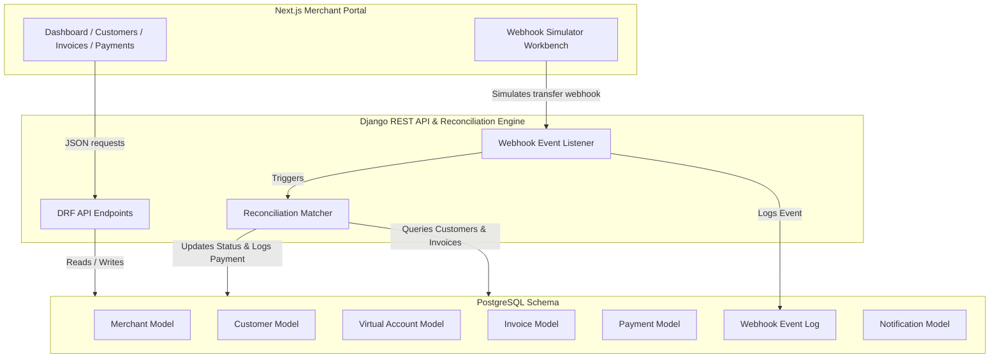

# ✈️ PayPilot

### Automated Payment Operations & Invoice Reconciliation powered by Nomba Virtual Accounts.

---

## 🏆 Hackathon Track
**Dedicated Virtual Accounts**

---

## 💡 One-Line Summary
PayPilot helps Nigerian businesses automate cash collections by provisioning persistent, dedicated virtual accounts to customers and instantly reconciling incoming transfers against pending invoices.

---

## 🛑 The Problem
Many Nigerian businesses still receive payments through bank transfers. The current reconciliation loop is highly manual and error-prone:
1. Customer initiates a bank transfer.
2. Merchant receives an SMS or bank alert.
3. Merchant checks the amount, matches it against a customer name or invoice, and updates a spreadsheet.
4. Merchant manually updates the customer order status.

This manual process doesn't scale. It leads to delays in order fulfillment, lost transactions, and hours spent auditing bank statements.

---

## 🎯 The Solution
**PayPilot** automates cash operations using Nomba's Dedicated Virtual Accounts API. 
* **Persistent Customer Accounts**: Every registered customer gets a dedicated, permanent virtual account number.
* **Auto-Reconciliation**: When money enters a virtual account, Nomba fires a webhook payload to PayPilot.
* **Real-time Invoice Resolution**: The PayPilot engine instantly maps the transfer to the corresponding customer profile, matches it against the oldest outstanding invoice, updates the billing status (Paid, Partial, or Overpaid), and registers the payment.

---

## 🛠️ Tech Stack

### Frontend
* **Framework**: Next.js 15+ (App Router)
* **Language**: TypeScript
* **Styling**: Tailwind CSS
* **Icons**: Lucide Icons
* **API Client**: Fetch API (Configured with type safety)

### Backend
* **Framework**: Django & Django REST Framework (DRF)
* **Language**: Python 3.10+
* **Database**: PostgreSQL (configured with Django ORM models)

---

## 📐 Architecture Overview

The system diagram below illustrates the relationship between the Next.js merchant portal, the Django REST backend, and Nomba's webhook dispatcher:



---

## 🔌 Backend API Routes

All resource management endpoints require a valid JWT bearer token inside the authorization header:
`Authorization: Bearer <your_access_token>`

### Authentication Endpoints
| Endpoint | Method | Description |
| :--- | :--- | :--- |
| `/api/auth/register/` | `POST` | Register a new merchant and receive signed JWT tokens |
| `/api/auth/login/` | `POST` | Exchange email + password for signed access & refresh tokens |
| `/api/auth/me/` | `GET` | Retrieve metadata of the currently logged-in merchant |
| `/api/auth/logout/` | `POST` | Invalidate/blacklist the merchant's refresh token |
| `/api/auth/token/refresh/` | `POST` | Exchange a valid refresh token for a new access token |

### Resource Endpoints
| Endpoint | Method | Description |
| :--- | :--- | :--- |
| `/api/customers/` | `GET` | List all customers scoped to the logged-in merchant |
| `/api/customers/` | `POST` | Register a customer & provision Nomba virtual account |
| `/api/customers/{id}/` | `GET` | Retrieve specific customer profile and ledger |
| `/api/customers/{id}/` | `PATCH` | Update customer metadata |
| `/api/customers/{id}/` | `DELETE` | Remove customer profile |
| `/api/invoices/` | `GET` | List merchant issued invoices |
| `/api/invoices/` | `POST` | Issue a new invoice mapped to a customer |
| `/api/invoices/{id}/` | `GET` | Retrieve invoice details |
| `/api/invoices/{id}/` | `PATCH` | Edit invoice parameters |
| `/api/payments/` | `GET` | View real-time incoming payments feed |
| `/api/payments/{id}/` | `GET` | Retrieve transaction details |
| `/api/dashboard/summary/` | `GET` | Compile merchant revenue and active metrics |
| `/api/reports/customers/{id}/statement/` | `GET` | Export aggregate customer ledger reports |
| `/api/webhooks/nomba/` | `POST` | Nomba Webhook receiver endpoint (No Authorization required) |

---

## 🔄 Core Lifecycles & Logic

### 1. Mock Nomba Provisioning Flow
When a merchant registers a customer profile on the dashboard, the backend triggers the provisioning flow:
* **Account Name Generation**: Combines the Merchant Business Name and the Customer Name (e.g., `Grace Foods / Tunde Bakare`).
* **Bank Mapping**: Assigns virtual accounts to **"Nomba Bank"** (or partner institutions).
* **Unique Identification**: Generates a unique 10-digit account number sequence mapped directly to the customer in the database.

### 2. Auto-Reconciliation Webhook Engine
When an incoming transfer payload is POSTed to `/api/webhooks/nomba/`:
1. **Locate Virtual Account**: The engine searches the database for the destination `account_number`.
   * **If not found**: Logs the transaction status as `UNMATCHED` and highlights it on the payments feed for manual review.
2. **Locate Pending Invoice**: If the account belongs to a registered customer, the engine retrieves their oldest unpaid or partially paid invoice (`PENDING` or `PARTIAL`).
3. **Reconcile Amounts**:
   * **Exact Match / Overpayment**: If the payment covers the outstanding balance, the invoice status changes to `PAID` (or `OVERPAID` if the transfer exceeded the due amount).
   * **Underpayment**: Updates status to `PARTIAL` and decrements the balance.
4. **Log Payment**: Creates a `Payment` object and associates it with the customer and resolved invoice.

---

## ⚙️ Local Development Setup

### Backend Setup (Django)

1. **Activate Environment & Install Dependencies**:
   ```bash
   cd backend
   python -m venv venv
   source venv/bin/activate  # On Windows: venv\Scripts\activate
   pip install -r requirements.txt
   ```

2. **Run Migrations**:
   ```bash
   python manage.py migrate
   ```

3. **Populate Seed Data**:
   Pre-seeds default merchant, customer directories, and outstanding invoice records:
   ```bash
   python manage.py seed_data
   ```

4. **Start Dev Server**:
   ```bash
   python manage.py runserver
   ```
   API runs at **`http://localhost:8000`**.

---

### Frontend Setup (Next.js)

1. **Install Dependencies**:
   ```bash
   cd frontend
   npm install
   ```

2. **Boot Compiler Server**:
   ```bash
   npm run dev
   ```
   Portal opens at **`http://localhost:3000`**.

---

## 🔐 Sandbox Demo Access
To make live evaluation seamless:
* **Autologin Fallback**: If no auth header token is supplied, the backend falls back to the default merchant profile created by the seed script:
  * **Email**: `info@gracefoods.ng`
  * **Business Name**: Grace Foods

---

## 📸 Screenshots (Placeholders)

### 1. Merchant Dashboard Overview
*Key metrics, collections chart, outstanding merchant balances, and active transaction logs.*
``

### 2. Webhook Simulator Workbench
*An interactive developer workbench to pre-fill accounts, construct raw transfer payloads, fire alerts, and watch the reconciliation engine match entries in real-time.*
``

---

## 📈 What is Left to Build & Stage 2 Nomba API Integration Plan

### Current Status (Stage 1 Completed)
* Completed database schema design (Django Models).
* Implemented core business logic (Virtual Account provisioning mock, Webhook parsing, Auto-Reconciliation).
* Built a Next.js 15+ frontend portal.
* Completed a Webhook Developer Workbench.

### Upcoming Roadmap (Stage 2 Integration Plan)
To transition from a mock framework to production:
1. **Nomba Account Provisioning API**: Replace our mock function with a client call to Nomba’s `/v1/accounts` endpoint:
   ```python
   # Future implementation snippet:
   headers = {
       "Authorization": f"Bearer {token}",
       "accountId": MERCHANT_ACCOUNT_ID
   }
   payload = {
       "accountRef": customer_uuid,
       "phoneNumber": customer.phone,
       "email": customer.email,
       "bankCode": "100026", # Nomba Partner code
       "accountName": f"{merchant.business_name} - {customer.full_name}"
   }
   response = requests.post("https://api.nomba.com/v1/accounts", json=payload, headers=headers)
   ```
2. **Nomba Webhook Signature Validation**: Implement cryptographic verification using Nomba's webhook secret signatures headers (`X-Nomba-Signature`) to guarantee inbound transaction payloads are authentic.
3. **Advanced Reconciliation Analytics**: Introduce invoice reminders, automated SMS alerts for customers upon payment match, and accounting exports (CSV/Excel).
